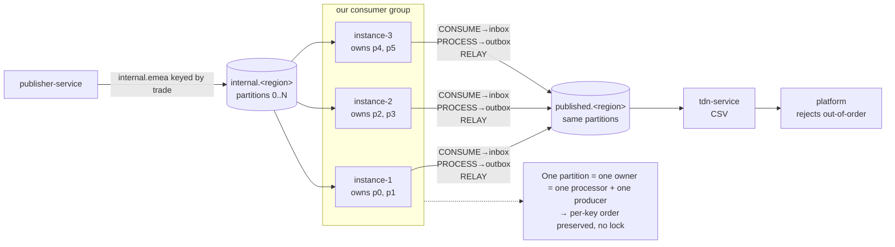

# ADR 0001 — Partition-aligned processing for per-key ordering and dynamic scaling

- Status: **Proposed**
- Date: 2026-07-01
- Deciders: booking-confirmation team + architecture
- Supersedes: the per-region distributed lock (removed in branch
  `claude/distributed-lock-rationale-880c6p`)

## Context

`booking-confirmation-service` sits in the middle of this chain:

```
publisher-service ─► internal.<region> ─► THIS service ─► published.<region> ─► tdn-service ─► platform
   (emits trades)      (Kafka, keyed)     (consume,        (Kafka, keyed)       (writes CSV)   (rejects
                                           aggregate,                                            out-of-order)
                                           enrich, filter,
                                           republish)
```

The Kafka message key is the **trade reference**: all events of one trade
(CREATED → AMENDED → BUSTED) share the same key, so they land on the same
partition of every topic.

**The hard requirement.** The platform at the end of the chain rejects a trade
whose `AMENDED` arrives before its `CREATED`. `tdn-service` only forwards; it
does not reorder. So **per-key (per-trade) ordering must be guaranteed by this
service on `published.<region>`.** Nobody downstream can repair a wrong order.

### Why the current design cannot meet it once we scale out

Today the pipeline runs three scheduled stages (PROCESS, RELAY, REQUEUE) that
drain region-scoped DB tables (inbox → outbox) using
`SELECT … FOR UPDATE SKIP LOCKED`. Horizontal scaling was coordinated by a
per-region distributed lock (now removed).

`SKIP LOCKED` guarantees **no double-processing** (each row is claimed by one
transaction) but it does **not** guarantee ordering. With more than one instance
active on the same region, two independent hazards appear:

1. **RELAY — multiple producers.** Two instances relaying the same key are two
   idempotent producers with different PIDs. Kafka preserves per-partition order
   *per producer*, never *across* producers. Same-key co-location in one
   partition fixes *where* records land, not *in what order* two producers append
   them.

2. **PROCESS — out-of-order availability.** Two instances draining the inbox
   concurrently can claim a key's *later* event (higher inbox id) and its
   *earlier* event separately. If the later one commits first, its outbox row
   becomes relayable before the earlier one exists — so even a perfect
   single-producer RELAY publishes them out of order.

The per-region lock closes both by making **one instance own a region's whole
pipeline at a time** — one processor, one producer. But that caps throughput at
**one active instance per region**: there is no intra-region parallelism, which
conflicts with the goal of dynamic horizontal scaling.

We therefore have a structural tension: **the region is the wrong unit of work.**
Ordering is a per-*key* property, but we serialize per *region*.

## Decision drivers

- **D1 — Ordering:** per-key order on `published.<region>` must hold end to end,
  including across retries.
- **D2 — Dynamic scalability:** instances can be added/removed at will, with
  parallelism *within* a region, not just across the three regions.
- **D3 — Automatic failover:** an instance dying must not stall or reorder a
  region.
- **D4 — Auditability / durability:** the DB store-and-forward record
  (inbox/outbox) is valuable for audit, replay and reconciliation (regulated
  context) and should be preserved unless there is a strong reason to drop it.
- **D5 — Incremental migration:** prefer an evolution of the current codebase
  over a ground-up rewrite.

## Options considered

### Option A — Keep serializing per region (reinstate the distributed lock)

One instance owns a region's PROCESS + RELAY at a time.

- ✅ D1, ✅ D3, ✅ D5. Simple, low risk, ships now.
- ❌ D2: **no intra-region parallelism** — ceiling is one active instance per
  region (three "lanes" total). Extra instances are warm standby only.

### Option B1 — Partition-aligned processing, DB inbox/outbox retained (**chosen**)

Make the **Kafka partition** the unit of work and ordering instead of the region.
This service joins a consumer group; Kafka assigns partitions to instances and
rebalances on join/leave. PROCESS and RELAY operate only on the partitions the
instance currently **owns**, not on the whole region. The DB inbox/outbox stays,
but drains are scoped by partition (the inbox already carries `KAFKA_PARTITION`;
the outbox gains one).

- ✅ D1: a key lives on one partition, owned by one instance → one processor,
  one producer, in offset order → ordered natively. No lock.
- ✅ D2: parallelism = number of partitions per region, not one per region.
- ✅ D3: consumer-group rebalance is the failover mechanism (no lock TTL).
- ✅ D4: DB record preserved.
- ✅ D5: incremental — the stages, aggregation, enrich/filter, and outbox all
  stay; what changes is the *scoping* of the drain (region → owned partitions)
  and the *coordinator* (DB lock → Kafka group membership).
- ⚠️ Cost: partition-ownership must be wired from a `ConsumerRebalanceListener`
  into the drain queries; rebalance fencing and a per-key retry policy must be
  handled (see Consequences).

### Option B2 — Full streaming (Kafka Streams, exactly-once)

Drop the DB inbox/outbox; consume → aggregate in a state store → enrich → filter
→ produce, with exactly-once semantics.

- ✅ D1, D2, D3 natively; cleanest ordering + EOS story.
- ❌ D4: loses the DB store-and-forward audit record.
- ❌ D5: a rewrite; aggregation becomes windowing/suppression; requires
  Kafka Streams expertise and state-store operations.
- Deferred as a possible long-term direction, not chosen now.

### Option C — Publish out of order + reorder downstream (sequence numbers)

Tag each message with a per-key sequence and let the consumer reorder.

- ❌ Ruled out by the topology: the platform rejects (does not reorder) and
  `tdn-service` only forwards. Making `tdn-service` a stateful reorder buffer is
  fragile, and our **aggregation/filtering creates sequence gaps** (a collapsed
  CREATED+BUSTED emits nothing), so a gap-waiting consumer would block. Ordering
  must be guaranteed at the source.

## Decision

Adopt **Option B1**: pivot the unit of work and ordering from the **region** to
the **Kafka partition**, using consumer-group membership as the coordinator, and
retire the distributed lock permanently. Keep the DB inbox/outbox for durability
and audit. Keep **Option B2 (Kafka Streams)** on the table as a future evolution
if state-store streaming later proves worthwhile.

## Target topology (B1)



Each partition has exactly one owner at a time (Kafka rebalance), so a trade's
events are processed and published by a single instance, in order. Parallelism
grows with partition count; instances join/leave freely.

## How ordering holds at each hop (B1)

| Hop | Ordering mechanism |
|-----|--------------------|
| Consume `internal.<region>` | Same key → same partition → one instance consumes it in offset order; inbox rows inserted with monotonic ids per key. |
| PROCESS (inbox → outbox) | Drain only owned partitions; one instance owns a partition → a key's events are processed in id order → outbox rows created in order. |
| RELAY (outbox → `published`) | Drain only owned partitions, ordered by id; single producer per owning instance → Kafka preserves per-partition order (idempotent producer). |
| Publish `published.<region>` | Same key → same partition; single producer → order preserved for `tdn-service` and the platform. |

## Consequences

### Positive
- Removes distributed-lock machinery entirely (no lock table, no TTL, no
  instance-id owner token). Kafka is the single coordinator.
- Intra-region parallelism scales with partition count; elastic add/remove of
  instances via the consumer group.
- Failover is native rebalance rather than lock expiry.

### Negative / to handle
1. **Rebalance fencing.** When a partition is reassigned, the losing instance
   must stop draining it before the gaining instance starts, or a key could be
   touched by two instances during the handover. Use cooperative rebalancing and
   `onPartitionsRevoked` to quiesce in-flight drains for revoked partitions.
2. **Retry without reordering (head-of-line per key).** On a Kafka send failure,
   a key's later events must not overtake the failed earlier one. Implemented: the
   RELAY drain only claims a `NEW` row when every earlier same-key row is already
   `SENT` (`NOT EXISTS` gate on `(REGION, MESSAGE_KEY, ID)`). A failed earlier
   event therefore blocks its own key until it is requeued and finally sent; other
   keys are unaffected. Keyless (`null` message key) rows are never blocked.
3. **Aggregation window.** Today the window is "one drain batch". Re-express it
   per owned partition; confirm the collapse rules (CREATED+BUSTED → drop) remain
   best-effort-per-window and downstream-correct.
4. **Outbox schema.** Add `KAFKA_PARTITION` to `BOOKING_CONFIRMATION_OUTBOX` and
   index the drain by `(PROCESSING_STATUS, KAFKA_PARTITION, ID)`.

## Migration plan (from the current lock-removed state)

1. **Schema:** add `KAFKA_PARTITION` to the outbox; carry the partition from the
   inbox row through PROCESS into the outbox row; add the partition-scoped drain
   index.
2. **Ownership source:** add a `ConsumerRebalanceListener` that tracks the set of
   partitions this instance owns per region topic; expose it to the stages.
3. **Scope the drains:** change `InboxRepository.findNew` / `OutboxRepository.findNew`
   from `WHERE region = :region` to `WHERE region = :region AND kafka_partition IN (:ownedPartitions)`.
   Keep `FOR UPDATE SKIP LOCKED` as a cheap belt-and-braces guard during
   rebalance windows.
4. **Fencing:** on `onPartitionsRevoked`, stop scheduling/among-flight drains for
   revoked partitions before returning.
5. **Retry policy:** implement per-key head-of-line blocking in RELAY/REQUEUE.
6. **Delete the lock for good:** the lock is already removed on the branch; this
   ADR records that it is not coming back.
7. **Validate:** partition scoping and per-key head-of-line gating (incl. a
   failed-then-requeued earlier event) are covered against a real Oracle by
   `OutboxOrderingIT` (Testcontainers, `mvn verify`). Still TODO: an end-to-end
   test with N instances and a rebalance mid-drain asserting per-key order on
   `published.<region>`.

## Resolved sizing

- **Partitions per `internal.<region>` = 12** (36 across the three regions). With
  `consumer.concurrency = 3` this gives up to **12-way parallel draining per
  region** and a fully-utilised ceiling of **12 instances** (3 consumers each =
  36 consumers = 36 partitions, one apiece); beyond 12 instances consumers sit
  idle. 12 divides evenly by the common instance counts (1/2/3/4/6/12), so
  assignment stays balanced. Going past 12-way per region would require adding
  partitions — an ordering-aware migration (key→partition remap), not expected
  soon.
- **Per-key head-of-line blocking on send failure is accepted** (a permanently
  failed earlier event stalls only its own key until resolved). Implemented in
  the RELAY drain (see below); ops must alert on `RETRY_EXHAUSTED`.

## Open questions

- Cooperative rebalancing assumed — confirm the Kafka client/broker versions
  support it.
