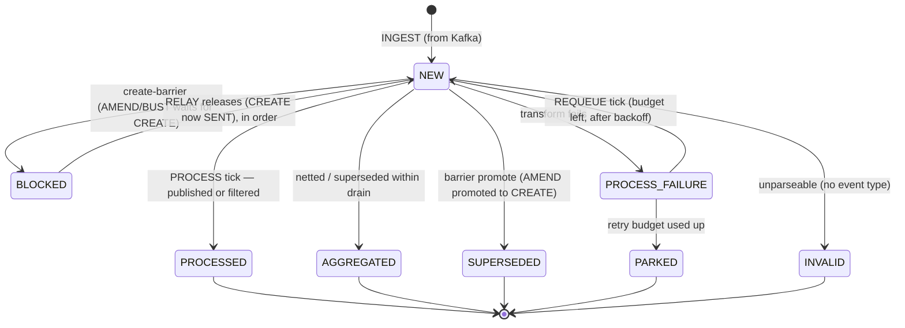
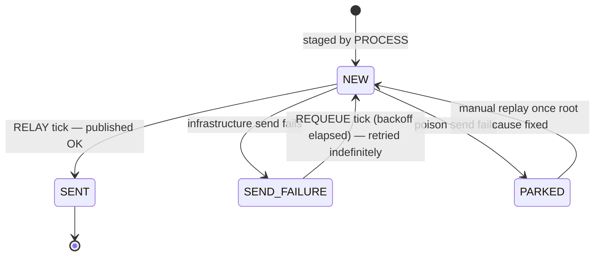
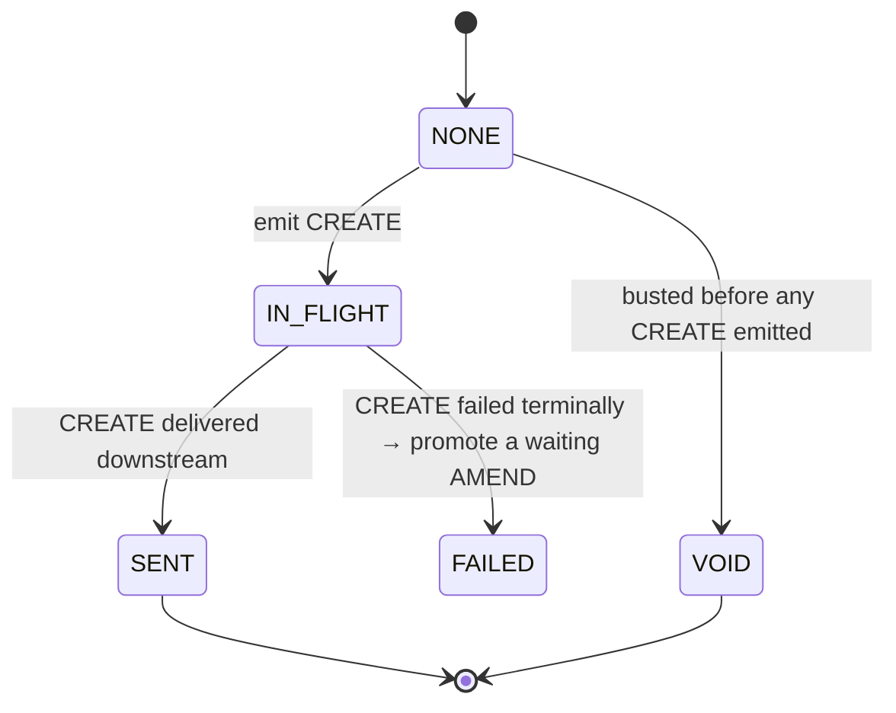
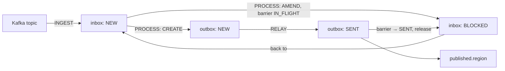

# Inbox & Outbox State Machines

This service uses the **inbox/outbox pattern** to move trade events from Kafka to a downstream
third party with no data loss and strict per-trade ordering. Two persistent tables each carry a
`status` column whose values form a small state machine, plus a third state machine — the
**create-barrier** — that gates when amendments may flow.

The three are driven by scheduled stages:

| Stage       | Reads            | Writes                                                            |
|-------------|------------------|------------------------------------------------------------------|
| **INGEST**  | Kafka            | inserts inbox rows as `NEW`                                       |
| **PROCESS** | inbox `NEW`      | transforms → stages outbox `NEW`; advances inbox row             |
| **RELAY**   | outbox `NEW`     | publishes to `published.<region>`; advances outbox + releases barriers |
| **REQUEUE** | `*_FAILURE` rows | moves failed rows back to `NEW` after backoff                     |

```
Kafka ──INGEST──► [ INBOX ] ──PROCESS──► [ OUTBOX ] ──RELAY──► published.<region>
                      ▲                       ▲
                      └──────── REQUEUE ──────┘   (retry failed rows, with backoff)
```

The inbox is the *consume + transform* half; the outbox is the *publish* half. Splitting them means
a transform failure never blocks publishing, a broker outage never blocks consuming, and every row is
durable, alerted and replayable rather than silently dropped.

---

## 1. Inbox states

Source: [`InboxStatus.java`](../src/main/java/com/bnpparibas/dec/bookingconfirmation/domain/model/InboxStatus.java)

| State             | Kind        | Meaning |
|-------------------|-------------|---------|
| `NEW`             | active      | Ingested from Kafka, awaiting the PROCESS tick. Also the state a row returns to after a retry or after a create-barrier releases it. |
| `PROCESSED`       | terminal ✅ | Payload was published (possibly re-typed) or deliberately filtered out. Done. |
| `AGGREGATED`      | terminal ✅ | Collapsed away — superseded or netted out by another event for the same trade within the same drain. Never published. |
| `BLOCKED`         | waiting ⏸  | An AMEND/BUST held behind the create-barrier until its trade's CREATE reaches `SENT`. Released back to `NEW` by RELAY, **in order**. |
| `SUPERSEDED`      | terminal ✅ | A stuck CREATE closed because a later AMEND was promoted into a CREATE in its place. Never published. |
| `PROCESS_FAILURE` | retrying 🔁 | The **transform** failed (not a Kafka send — that's the outbox). Picked up by REQUEUE. |
| `PARKED`          | terminal ⚠️ | Retry budget used up, or unrecoverable. Retained, alerted, replayable — never dropped. |
| `INVALID`         | terminal ⚠️ | No readable event type (unparseable). Retained, alerted, replayable. |

> **No data loss.** `PARKED` and `INVALID` are durable dead-letter buckets, not deletions.
> `PROCESS_FAILURE` retries with backoff before it can reach `PARKED`.

### Inbox transitions



---

## 2. Outbox states

Source: [`OutboxStatus.java`](../src/main/java/com/bnpparibas/dec/bookingconfirmation/domain/model/OutboxStatus.java)

| State          | Kind        | Meaning |
|----------------|-------------|---------|
| `NEW`          | active      | Staged by PROCESS, awaiting the RELAY tick to publish to `published.<region>`. |
| `SENT`         | terminal ✅ | Successfully published downstream. Done. |
| `SEND_FAILURE` | retrying 🔁 | **Infrastructure** send failure (broker down, timeout, circuit open). Retried **indefinitely** via REQUEUE — never abandoned. |
| `PARKED`       | terminal ⚠️ | Message-level **poison** (too large, non-serializable). Durable, alerted, replayable (`PARKED → NEW` once fixed). |

> **No data loss.** The DB outbox *is* the dead-letter store — a Kafka DLT can't help when Kafka
> itself is down. Only poison is parked; everything else retries forever.

### Outbox transitions



---

## 3. Create-barrier (per-trade gate)

Source: [`CreateState.java`](../src/main/java/com/bnpparibas/dec/bookingconfirmation/domain/model/CreateState.java)

The downstream third party rejects an AMEND/BUST whose CREATE it never received. So there is one gate
row per `(region, message key)` ensuring **an AMEND is never relayed before its trade's CREATE has
reached `SENT`**. This is the state machine that drives the inbox `NEW ⇄ BLOCKED` transitions above.

| State       | Meaning |
|-------------|---------|
| `NONE`      | Implicit state — no gate row / no CREATE seen yet for this trade. |
| `IN_FLIGHT` | A CREATE is staged in the outbox but not yet delivered. Amendments **wait** (inbox `BLOCKED`). |
| `SENT`      | CREATE delivered downstream. Amendments may now flow (inbox `BLOCKED → NEW`). |
| `FAILED`    | CREATE failed terminally (`INVALID`/`PARKED`); a waiting AMEND is auto-promoted into a CREATE. |
| `VOID`      | The trade was busted before any CREATE was emitted — nothing is published for it. |

### Create-barrier transitions



---

## 4. How the three connect (end-to-end)



1. **INGEST**: a Kafka record becomes an inbox row in `NEW`.
2. **PROCESS**: transforms the event. A CREATE stages an outbox `NEW` row and sets the barrier
   `IN_FLIGHT`; an AMEND/BUST whose CREATE isn't `SENT` yet goes to inbox `BLOCKED`. Events that net
   out become `AGGREGATED`; unparseable ones `INVALID`; transform failures `PROCESS_FAILURE`.
3. **RELAY**: publishes outbox `NEW → SENT`. When a CREATE reaches `SENT`, the barrier flips to `SENT`
   and the matching `BLOCKED` inbox rows are released back to `NEW`, in order.
4. **REQUEUE**: moves `PROCESS_FAILURE` (inbox) and `SEND_FAILURE` (outbox) rows back to `NEW` after
   backoff. Inbox transform retries are *budgeted* (then `PARKED`); outbox infra retries are *infinite*.

### Terminal-state cheat sheet

| Outcome                         | Inbox             | Outbox         |
|---------------------------------|-------------------|----------------|
| Success                         | `PROCESSED`       | `SENT`         |
| Collapsed / not published       | `AGGREGATED`, `SUPERSEDED` | —      |
| Needs attention (replayable)    | `PARKED`, `INVALID` | `PARKED`     |
| Transient — will retry          | `PROCESS_FAILURE`, `BLOCKED` | `SEND_FAILURE` |

---

## 5. Worked examples — every transition

Each example uses the same vocabulary:

- **Trade**: `T-1001`, event types `CREATE` / `AMEND` / `BUST`, region `AMER`.
- **Idempotency key**: `US:KOP:440230198_1:1832` (`hub:firm:externalTradeId:bookingConfirmationId`), or the
  fallback `<topic>_<partition>_<offset>` when the inbound header is missing.
- **Topics**: inbound `local.booking.trade.internal.amer`, outbound `published.amer`,
  dead-letter `local.booking.trade.internal.amer.DLT`.

A *trace* line shows the row(s) that move, as `table#id: FROM → TO`.

### 5.1 Inbox transitions

**A. `∅ → NEW` — INGEST**
- **Given** a `CREATE` for `T-1001` is produced to `local.booking.trade.internal.amer`.
- **When** the consumer polls it and the inbox write succeeds (offset committed only after the write).
- **Then** a new inbox row is persisted awaiting PROCESS.
- *Trace:* `inbox#1: ∅ → NEW`

**B. `NEW → PROCESSED` (published)**
- **Given** `inbox#1` is a `CREATE` for `T-1001` in `NEW`, and no gate row exists yet.
- **When** the PROCESS tick transforms it and stages an outbox row.
- **Then** the inbox row is done; the create-barrier opens.
- *Trace:* `inbox#1: NEW → PROCESSED`, `outbox#7: ∅ → NEW`, `gate(AMER,T-1001): NONE → IN_FLIGHT`

**C. `NEW → PROCESSED` (filtered out)**
- **Given** `inbox#2` is an event type that maps to nothing publishable downstream (e.g. an internal
  status change), or a duplicate whose idempotency key was already published.
- **When** PROCESS evaluates it.
- **Then** it is consciously *not* published, but the row is still completed (no loss, no resend).
- *Trace:* `inbox#2: NEW → PROCESSED` (no outbox row created)

**D. `NEW → AGGREGATED` — netted/superseded within a drain**
- **Given** in one PROCESS drain, `T-1001` has both `AMEND v1` (`inbox#3`) and a later `AMEND v2` (`inbox#4`).
- **When** PROCESS collapses the trade to its latest state — `v2` supersedes `v1`.
- **Then** only `v2` is published; `v1` is collapsed away and never sent.
- *Trace:* `inbox#3: NEW → AGGREGATED`, `inbox#4: NEW → PROCESSED`, `outbox#8: ∅ → NEW`
- **Variant (net to nothing):** a `CREATE` and a `BUST` for the same trade arrive in the same drain and
  cancel out — both end `AGGREGATED`, nothing is published.

**E. `NEW → BLOCKED` — create-barrier hold**
- **Given** an `AMEND` for `T-2002` (`inbox#5`) is `NEW`, but `T-2002`'s `CREATE` is still `IN_FLIGHT`
  (staged, not yet delivered).
- **When** PROCESS sees the barrier is not `SENT`.
- **Then** the amendment is held — it must not reach the third party before the CREATE.
- *Trace:* `inbox#5: NEW → BLOCKED` (gate stays `IN_FLIGHT`)

**F. `BLOCKED → NEW` — create-barrier release (in order)**
- **Given** `inbox#5` is `BLOCKED` and the `CREATE` for `T-2002` has just reached `SENT`.
- **When** the RELAY stage flips the gate to `SENT` and releases the waiters in arrival order.
- **Then** the amendment returns to `NEW` for the next PROCESS tick.
- *Trace:* `gate(AMER,T-2002): IN_FLIGHT → SENT`, `inbox#5: BLOCKED → NEW`

**G. `NEW → SUPERSEDED` — stuck CREATE closed, AMEND promoted**
- **Given** the `CREATE` for `T-3003` (`inbox#6`) keeps failing terminally and has nowhere to go, while an
  `AMEND` for `T-3003` (`inbox#7`) waits behind the barrier.
- **When** the barrier goes `FAILED` and the waiting `AMEND` is promoted *into* a CREATE in its place.
- **Then** the original CREATE row is closed as superseded (never published); the promoted AMEND carries the trade.
- *Trace:* `gate(AMER,T-3003): IN_FLIGHT → FAILED`, `inbox#6: NEW → SUPERSEDED`, `inbox#7: NEW → PROCESSED (promoted to CREATE)`

**H. `NEW → PROCESS_FAILURE` — transform fails**
- **Given** `inbox#8` is a valid event, but the transform throws (e.g. a transient enrichment/lookup error,
  or the outbox insert fails mid-transform).
- **When** PROCESS catches the failure.
- **Then** the row is parked for retry, *not* dropped. (This is a transform failure — Kafka *send* failures
  live in the outbox.)
- *Trace:* `inbox#8: NEW → PROCESS_FAILURE`

**I. `PROCESS_FAILURE → NEW` — REQUEUE with budget left**
- **Given** `inbox#8` is `PROCESS_FAILURE`, attempt 1 of 3, and the backoff window has elapsed.
- **When** the REQUEUE tick picks it up.
- **Then** it goes back to `NEW` for another PROCESS attempt.
- *Trace:* `inbox#8: PROCESS_FAILURE → NEW` (attempts = 1)

**J. `PROCESS_FAILURE → PARKED` — retry budget exhausted**
- **Given** `inbox#8` has now failed the transform `retry-max-attempts` times.
- **When** REQUEUE sees no budget remaining.
- **Then** the row is parked — durable, alerted, replayable; never silently dropped.
- *Trace:* `inbox#8: PROCESS_FAILURE → PARKED`

**K. `NEW → INVALID` — unparseable**
- **Given** `inbox#9`'s payload has no readable event type (corrupt/empty/null body, or an unknown schema).
- **When** PROCESS cannot determine what it is.
- **Then** it is quarantined as invalid — retained, alerted, replayable.
- *Trace:* `inbox#9: NEW → INVALID`

### 5.2 Outbox transitions

**L. `∅ → NEW` — staged by PROCESS**
- **Given** PROCESS publishes the `CREATE` for `T-1001` (example B).
- **When** it stages the outbound event carrying the propagated idempotency key.
- **Then** an outbox row awaits RELAY.
- *Trace:* `outbox#7: ∅ → NEW` (destination `published.amer`)

**M. `NEW → SENT` — RELAY publishes OK**
- **Given** `outbox#7` is `NEW`.
- **When** the RELAY tick sends it to `published.amer` and the broker acks.
- **Then** the row is complete and the matching create-barrier can open.
- *Trace:* `outbox#7: NEW → SENT`, `gate(AMER,T-1001): IN_FLIGHT → SENT`

**N. `NEW → SEND_FAILURE` — infrastructure send fails**
- **Given** `outbox#7` is `NEW`, but the broker is down / the send times out / the relay circuit is open.
- **When** RELAY attempts the send and it fails at the infrastructure level.
- **Then** the row is marked for retry — never abandoned.
- *Trace:* `outbox#7: NEW → SEND_FAILURE`

**O. `SEND_FAILURE → NEW` — REQUEUE, retried indefinitely**
- **Given** `outbox#7` is `SEND_FAILURE` and the backoff window has elapsed.
- **When** REQUEUE picks it up (infinite attempts — a broker outage must never drop a message).
- **Then** it returns to `NEW` to be relayed again once Kafka recovers.
- *Trace:* `outbox#7: SEND_FAILURE → NEW`

**P. `NEW → PARKED` — poison send**
- **Given** `outbox#10` can never be sent regardless of broker health — payload too large, or non-serializable.
- **When** RELAY classifies the failure as message-level poison (see `SendFailureClassifier`).
- **Then** it is parked in the DB dead-letter bucket — durable, alerted, replayable. (A Kafka DLT can't help
  when Kafka itself is the thing that's down; the DB outbox *is* the DLT here.)
- *Trace:* `outbox#10: NEW → PARKED`

**Q. `PARKED → NEW` — manual replay after fix**
- **Given** `outbox#10` was `PARKED`; ops fixed the root cause (e.g. raised the broker message-size limit).
- **When** the row is replayed.
- **Then** it re-enters the relay flow.
- *Trace:* `outbox#10: PARKED → NEW`

### 5.3 Create-barrier transitions

**R. `∅ → NONE` — implicit**
- No gate row exists yet for a trade; `NONE` is assumed.

**S. `NONE → IN_FLIGHT` — emit CREATE**
- **Given** the first `CREATE` for `T-1001` is staged to the outbox (example B).
- **Then** the gate opens in-flight; any amendment that arrives now will be `BLOCKED`.
- *Trace:* `gate(AMER,T-1001): NONE → IN_FLIGHT`

**T. `IN_FLIGHT → SENT` — CREATE delivered**
- **Given** the gate is `IN_FLIGHT` and the CREATE outbox row reaches `SENT` (example M).
- **Then** amendments may flow; blocked rows are released (example F).
- *Trace:* `gate(AMER,T-1001): IN_FLIGHT → SENT`

**U. `IN_FLIGHT → FAILED` — CREATE fails terminally**
- **Given** the gate is `IN_FLIGHT` but the CREATE went `INVALID`/`PARKED` and will never be delivered.
- **Then** the gate fails and a waiting `AMEND` is auto-promoted into a CREATE (example G).
- *Trace:* `gate(AMER,T-3003): IN_FLIGHT → FAILED`

**V. `NONE → VOID` — busted before any CREATE**
- **Given** a `BUST` for `T-4004` arrives but no `CREATE` was ever emitted for it.
- **When** PROCESS sees there is nothing downstream to amend or cancel.
- **Then** the gate is voided — nothing is published for that trade.
- *Trace:* `gate(AMER,T-4004): NONE → VOID`, `inbox#11: NEW → AGGREGATED` (nothing to publish)

---

## 6. End-to-end scenarios (multiple machines)

**Scenario 1 — Happy path: CREATE then AMEND, in order**
```
CREATE T-1001  inbox#1: NEW → PROCESSED     outbox#7: ∅ → NEW → SENT     gate: NONE → IN_FLIGHT → SENT
AMEND  T-1001  inbox#2: NEW → PROCESSED     outbox#8: ∅ → NEW → SENT     gate stays SENT (amend flows freely)
```

**Scenario 2 — Out-of-order: AMEND arrives before its CREATE**
```
AMEND  T-2002  inbox#5: NEW → BLOCKED                                    gate: IN_FLIGHT (CREATE not yet sent)
CREATE T-2002  inbox#4: NEW → PROCESSED     outbox#9:  ∅ → NEW → SENT    gate: IN_FLIGHT → SENT
               inbox#5: BLOCKED → NEW       (released, in order)
               inbox#5: NEW → PROCESSED     outbox#10: ∅ → NEW → SENT
```

**Scenario 3 — Duplicate delivery (at-least-once)**
```
CREATE T-1001 (1st copy)  inbox#1: NEW → PROCESSED  outbox#7: ∅ → NEW → SENT
CREATE T-1001 (2nd copy)  inbox#1b: NEW → PROCESSED (filtered — same idempotency key, not re-published)
```
*This is the `shouldHandleDuplicateMessages_withSameIdempotencyKey` test.*

**Scenario 4 — DB outage during PROCESS (infrastructure, retried forever)**
```
CREATE T-1001  inbox#1: NEW → PROCESS_FAILURE        (outbox insert hit a dead DB)
               inbox#1: PROCESS_FAILURE → NEW        REQUEUE, attempt 1, after backoff
               inbox#1: NEW → PROCESS_FAILURE        DB still down
               ...                                   repeats; offset never advances (back-pressure)
               inbox#1: NEW → PROCESSED              DB recovered — processed in order, nothing lost
```
> Consumer-side infra failures behave the same: retried with backoff, offset held — no skip.

**Scenario 5 — Poison payload**
```
Inbound (consumer): unparseable body
   bounded retry on the listener → routed to local.booking.trade.internal.amer.DLT
Or, unparseable at transform:
   inbox#9: NEW → INVALID                            (durable, alerted, replayable)
Or, un-sendable outbound:
   outbox#10: NEW → PARKED                           (too large / non-serializable)
```

**Scenario 6 — CREATE fails terminally, AMEND promoted**
```
CREATE T-3003  inbox#6: NEW → PROCESS_FAILURE → ... → PARKED   gate: IN_FLIGHT → FAILED
AMEND  T-3003  inbox#7: NEW → BLOCKED                          (was waiting)
               inbox#6: NEW... → SUPERSEDED                    (stuck CREATE closed)
               inbox#7: BLOCKED → NEW → PROCESSED (promoted to CREATE)  outbox: ∅ → NEW → SENT
```

**Scenario 7 — BUST before any CREATE**
```
BUST T-4004  inbox#11: NEW → AGGREGATED              gate: NONE → VOID  (nothing ever published)
```

**Scenario 8 — Netting within one drain**
```
AMEND v1 T-1001  inbox#3: NEW → AGGREGATED           (superseded by v2 in the same drain)
AMEND v2 T-1001  inbox#4: NEW → PROCESSED            outbox#8: ∅ → NEW → SENT
```

**Scenario 9 — Broker down during RELAY, then recovery**
```
CREATE T-1001  inbox#1: NEW → PROCESSED   outbox#7: ∅ → NEW
RELAY tick     outbox#7: NEW → SEND_FAILURE          (broker unreachable)
REQUEUE        outbox#7: SEND_FAILURE → NEW          (backoff elapsed, infinite retries)
RELAY tick     outbox#7: NEW → SENT                  (broker back) → gate: IN_FLIGHT → SENT
```

**Scenario 10 — Missing idempotency header (fallback key)**
```
CREATE T-1001 (no idempotency header)
   inbox#1: NEW → PROCESSED   idempotencyKey = local.booking.trade.internal.amer_0_0  (topic_partition_offset)
```
*This is the `shouldUseDefaultIdempotencyKey_whenHeaderMissing` test.*

---

## 7. Integration tests → transitions exercised

| Test (`IngestionProcessIITest`)                       | Transitions covered |
|-------------------------------------------------------|---------------------|
| `shouldStoreMessageInInbox_whenValidRecord`           | `∅ → NEW` (A) |
| `shouldUseDefaultIdempotencyKey_whenHeaderMissing`    | `∅ → NEW` with fallback key (scenario 10) |
| `shouldHandleDuplicateMessages_withSameIdempotencyKey`| dedup / filtered `NEW → PROCESSED` (scenario 3) |
| `shouldHandleMultipleRegionsIndependently`            | independent inbox rows per region (A, B) |
| `shouldProcessMultipleMessagesFromSameTopic`          | batch `∅ → NEW → PROCESSED` (A, B) |
| `shouldRespectRegionPartitioning`                     | region routing into separate inbox rows |
| `shouldHandleNullPayload`                             | `NEW → INVALID` (K) |
