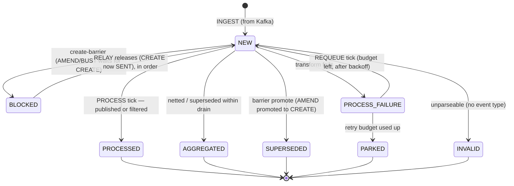
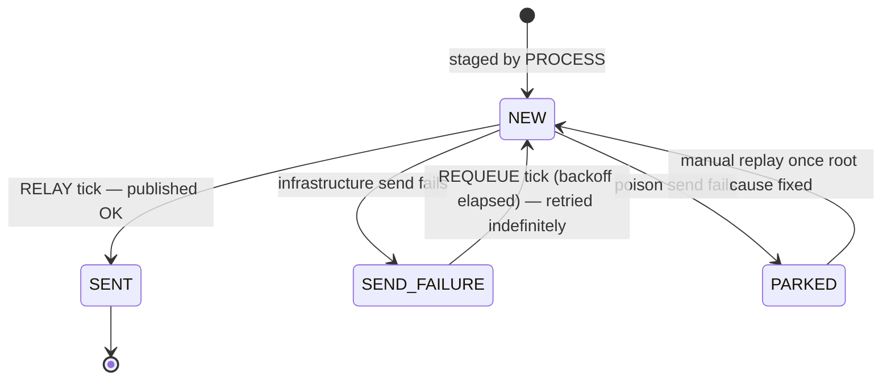
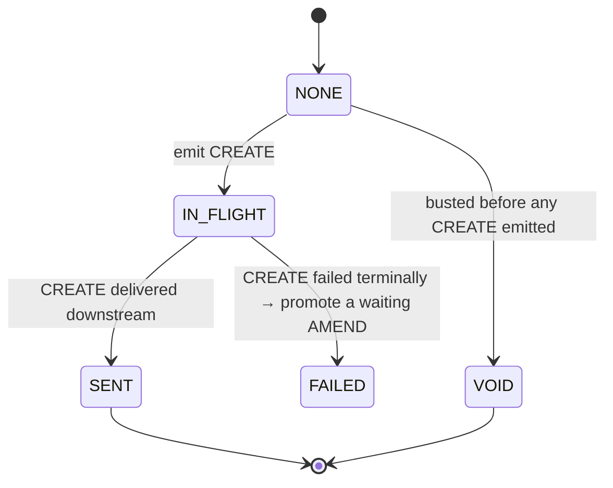
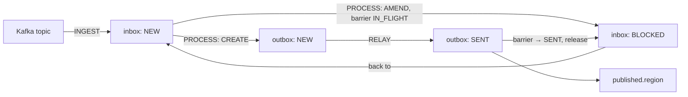

# Inbox & Outbox State Machines

This service uses the **inbox/outbox pattern** to move trade events from Kafka to a downstream
third party with no data loss and strict per-trade ordering. Two persistent tables each carry a
`status` column whose values form a small state machine, plus a third state machine — the
**create-barrier** — that gates when amendments may flow.

The three are driven by scheduled stages:

| Stage       | Reads            | Writes                                                            |
|-------------|------------------|------------------------------------------------------------------|
| **INGEST**  | Kafka            | inserts inbox rows as `NEW`                                       |
| **PROCESS** | inbox `NEW`      | transforms → stages outbox `NEW`; advances inbox row             |
| **RELAY**   | outbox `NEW`     | publishes to `published.<region>`; advances outbox + releases barriers |
| **REQUEUE** | `*_FAILURE` rows | moves failed rows back to `NEW` after backoff                     |

```
Kafka ──INGEST──► [ INBOX ] ──PROCESS──► [ OUTBOX ] ──RELAY──► published.<region>
                      ▲                       ▲
                      └──────── REQUEUE ──────┘   (retry failed rows, with backoff)
```

The inbox is the *consume + transform* half; the outbox is the *publish* half. Splitting them means
a transform failure never blocks publishing, a broker outage never blocks consuming, and every row is
durable, alerted and replayable rather than silently dropped.

---

## 1. Inbox states

Source: [`InboxStatus.java`](../src/main/java/com/bnpparibas/dec/bookingconfirmation/domain/model/InboxStatus.java)

| State             | Kind        | Meaning |
|-------------------|-------------|---------|
| `NEW`             | active      | Ingested from Kafka, awaiting the PROCESS tick. Also the state a row returns to after a retry or after a create-barrier releases it. |
| `PROCESSED`       | terminal ✅ | Payload was published (possibly re-typed) or deliberately filtered out. Done. |
| `AGGREGATED`      | terminal ✅ | Collapsed away — superseded or netted out by another event for the same trade within the same drain. Never published. |
| `BLOCKED`         | waiting ⏸  | An AMEND/BUST held behind the create-barrier until its trade's CREATE reaches `SENT`. Released back to `NEW` by RELAY, **in order**. |
| `SUPERSEDED`      | terminal ✅ | A stuck CREATE closed because a later AMEND was promoted into a CREATE in its place. Never published. |
| `PROCESS_FAILURE` | retrying 🔁 | The **transform** failed (not a Kafka send — that's the outbox). Picked up by REQUEUE. |
| `PARKED`          | terminal ⚠️ | Retry budget used up, or unrecoverable. Retained, alerted, replayable — never dropped. |
| `INVALID`         | terminal ⚠️ | No readable event type (unparseable). Retained, alerted, replayable. |

> **No data loss.** `PARKED` and `INVALID` are durable dead-letter buckets, not deletions.
> `PROCESS_FAILURE` retries with backoff before it can reach `PARKED`.

### Inbox transitions



---

## 2. Outbox states

Source: [`OutboxStatus.java`](../src/main/java/com/bnpparibas/dec/bookingconfirmation/domain/model/OutboxStatus.java)

| State          | Kind        | Meaning |
|----------------|-------------|---------|
| `NEW`          | active      | Staged by PROCESS, awaiting the RELAY tick to publish to `published.<region>`. |
| `SENT`         | terminal ✅ | Successfully published downstream. Done. |
| `SEND_FAILURE` | retrying 🔁 | **Infrastructure** send failure (broker down, timeout, circuit open). Retried **indefinitely** via REQUEUE — never abandoned. |
| `PARKED`       | terminal ⚠️ | Message-level **poison** (too large, non-serializable). Durable, alerted, replayable (`PARKED → NEW` once fixed). |

> **No data loss.** The DB outbox *is* the dead-letter store — a Kafka DLT can't help when Kafka
> itself is down. Only poison is parked; everything else retries forever.

### Outbox transitions



---

## 3. Create-barrier (per-trade gate)

Source: [`CreateState.java`](../src/main/java/com/bnpparibas/dec/bookingconfirmation/domain/model/CreateState.java)

The downstream third party rejects an AMEND/BUST whose CREATE it never received. So there is one gate
row per `(region, message key)` ensuring **an AMEND is never relayed before its trade's CREATE has
reached `SENT`**. This is the state machine that drives the inbox `NEW ⇄ BLOCKED` transitions above.

| State       | Meaning |
|-------------|---------|
| `NONE`      | Implicit state — no gate row / no CREATE seen yet for this trade. |
| `IN_FLIGHT` | A CREATE is staged in the outbox but not yet delivered. Amendments **wait** (inbox `BLOCKED`). |
| `SENT`      | CREATE delivered downstream. Amendments may now flow (inbox `BLOCKED → NEW`). |
| `FAILED`    | CREATE failed terminally (`INVALID`/`PARKED`); a waiting AMEND is auto-promoted into a CREATE. |
| `VOID`      | The trade was busted before any CREATE was emitted — nothing is published for it. |

### Create-barrier transitions



---

## 4. How the three connect (end-to-end)



1. **INGEST**: a Kafka record becomes an inbox row in `NEW`.
2. **PROCESS**: transforms the event. A CREATE stages an outbox `NEW` row and sets the barrier
   `IN_FLIGHT`; an AMEND/BUST whose CREATE isn't `SENT` yet goes to inbox `BLOCKED`. Events that net
   out become `AGGREGATED`; unparseable ones `INVALID`; transform failures `PROCESS_FAILURE`.
3. **RELAY**: publishes outbox `NEW → SENT`. When a CREATE reaches `SENT`, the barrier flips to `SENT`
   and the matching `BLOCKED` inbox rows are released back to `NEW`, in order.
4. **REQUEUE**: moves `PROCESS_FAILURE` (inbox) and `SEND_FAILURE` (outbox) rows back to `NEW` after
   backoff. Inbox transform retries are *budgeted* (then `PARKED`); outbox infra retries are *infinite*.

### Terminal-state cheat sheet

| Outcome                         | Inbox             | Outbox         |
|---------------------------------|-------------------|----------------|
| Success                         | `PROCESSED`       | `SENT`         |
| Collapsed / not published       | `AGGREGATED`, `SUPERSEDED` | —      |
| Needs attention (replayable)    | `PARKED`, `INVALID` | `PARKED`     |
| Transient — will retry          | `PROCESS_FAILURE`, `BLOCKED` | `SEND_FAILURE` |
